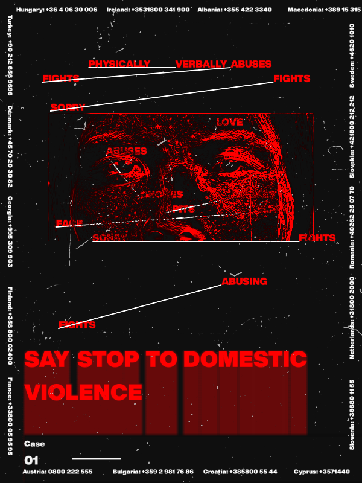
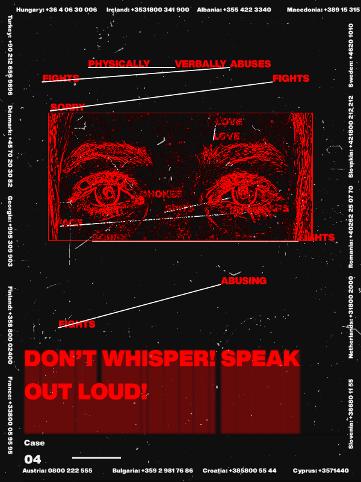

## Dynamic data-generated posters on the topic of domestic violence

Data-generated posters on the topic of domestic violence, using images and victim testamonies to create an intimate visual experience and hopefully invoke some **simpathy** and motivate research on the topic in the audience.

This project was part of a workshop on generative posters organized by [RNDR](https://rndr.studio/), an interactive media studio who developed their own framework for visual computing called [OpenRNDR](https://openrndr.org/) based on Kotlin. 

Here are a few static image examples.

